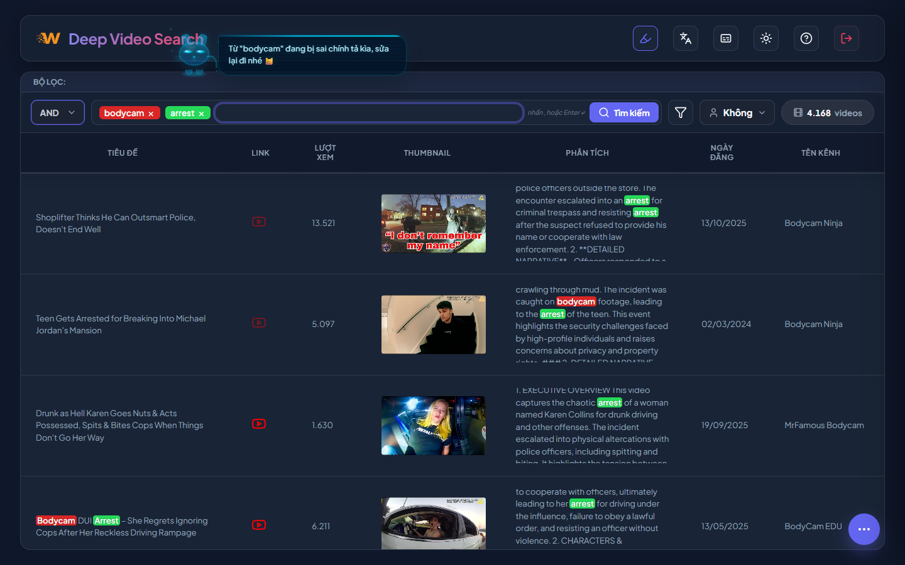
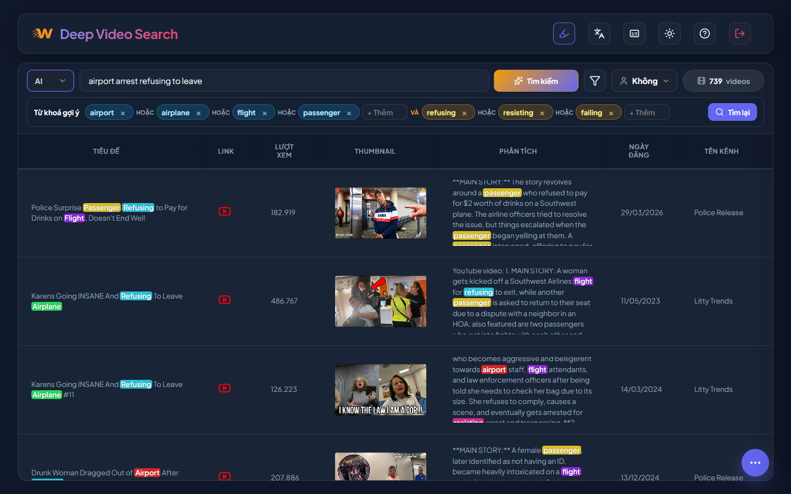
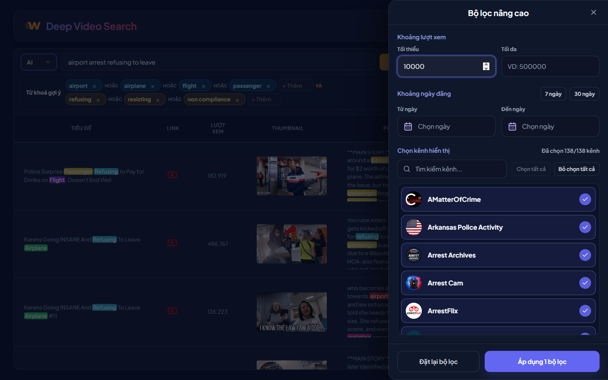
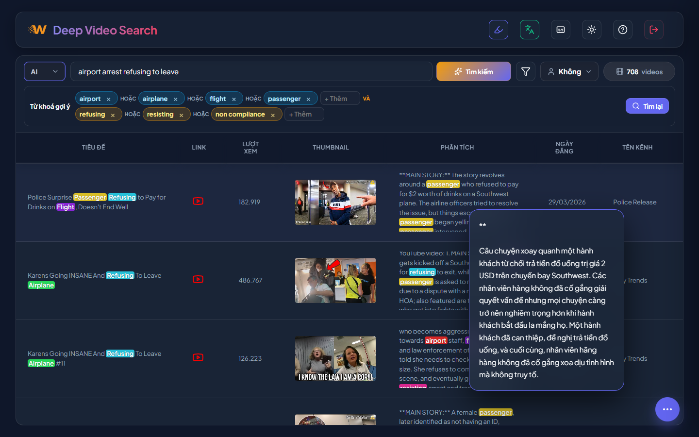

# Deep Video Search

> A secure video intelligence workspace for searching, filtering, and managing large YouTube metadata datasets.

[](https://nextjs.org/)
[](https://react.dev/)
[](https://www.postgresql.org/)
[](LICENSE)

Deep Video Search is a web application for searching and reviewing large collections of YouTube video records. It helps research and operations teams find relevant videos by keywords, AI-generated query plans, captions, summaries, channels, publish dates, and view ranges. The app combines a Next.js interface, Supabase authentication, PostgreSQL-backed video storage, Google Sheets usage profiles, and Ollama-powered analysis workflows. Its focus is fast review, practical filtering, and repeatable admin workflows for keeping the video database fresh.

## Demo

The feature gallery below shows the core search and review workflows in the application.

## Features

### Keyword search

Search across video titles, captions, and AI summaries with compact keyword tags, `AND` / `OR` logic, profile selection, and result counts in one toolbar.



### AI-assisted search

Describe a topic in natural language, let the app generate editable keyword groups, then run an advanced query without leaving the search workflow.



### Advanced filters

Narrow large result sets by view ranges, publish dates, and selected channels while keeping the active search context visible.



### Highlight and translation review

Review matches faster with highlighted keywords, caption search, and hover translation for long analysis text.



### Workflow coverage

- Supabase Auth protects user access.
- Usage profiles hide videos already used in connected Google Sheets.
- The video table displays thumbnails, metadata, summaries, captions, and YouTube links.
- The admin workspace supports channel management, queued channel requests, daily updates, logs, backups, and account administration.
- The dark-first interface includes onboarding guidance for new users.

## Installation

System requirements:

- Node.js `>= 20.9`
- npm `>= 10`
- Docker and Docker Compose
- PostgreSQL 16, unless using the included Docker service
- Python `>= 3.10` for video analysis/update scripts
- Ollama for AI search and summary analysis workflows

Clone the repository:

```bash
git clone https://github.com/leducminh85/deep-searching.git
cd deep-searching
```

Install the Next.js dependencies:

```bash
cd nextjs-app
npm install
```

Create `nextjs-app/.env.local` and configure the required Supabase, PostgreSQL, admin, YouTube, Ollama, and Google service account variables for your environment.

Run the development server:

```bash
npm run dev
```

Open the app:

```text
http://localhost:3000
```

Run with Docker Compose from the repository root:

```bash
cd ..
docker compose up -d --build
```

The Docker app is exposed by default at:

```text
http://127.0.0.1:3000
```

## Usage

Basic user flow:

1. Sign in with a Supabase Auth account.
2. Enter keywords in the search bar and choose `AND` or `OR`.
3. Switch the search mode to `AI` to describe a topic and generate editable keyword groups.
4. Open advanced filters to narrow results by view count, date range, or channel.
5. Select a usage profile to hide videos already used in connected Google Sheets.
6. Review results in the video table, open YouTube links, inspect thumbnails, and read summaries or captions.
7. Use `/admin` to manage channels, queued channel requests, daily updates, logs, backups, and account administration.

Start the local app:

```bash
cd nextjs-app
npm run dev
```

Example output:

```text
Next.js 16.x
Local: http://localhost:3000
```

Build and start production mode:

```bash
cd nextjs-app
npm run build
npm run start
```

## License

This project is licensed under the [MIT License](LICENSE).
